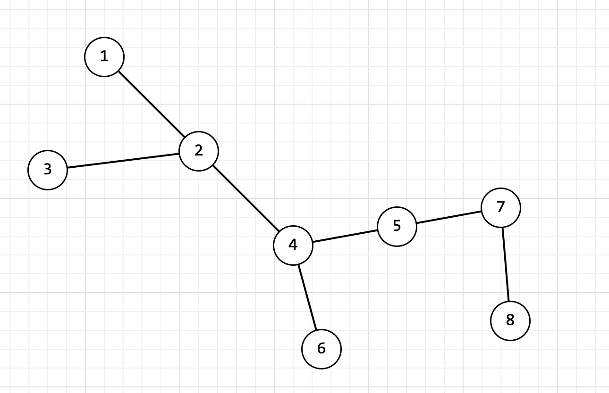

# **_Вариант № 3_**

### 1.

Дан неупорядоченный граф, представленный в следующем виде 

В алгебраическом виде представим этот граф следующим образом

G = {V, E},

Где V - количество вершин, V = {1, 2, 3, 4, 5, 6, 7, 8}

И где E - количество ребер, E = {(1, 2), (2, 3), (2, 4), (4, 5), (4, 6), (5, 7), (7, 8)}

Составим _**матрицу смежности**_ (матрица составляется размером N x N, где N — количество вершин):

|      | *x1* | *x2* | *x3* | *x4* | *x5* | *x6* | *x7* | *x8* |
|------|------|------|------|------|------|------|------|------|
| *x1* | 0    | 1    | 0    | 0    | 0    | 0    | 0    | 0    |
| *x2* | 1    | 0    | 1    | 1    | 0    | 0    | 0    | 0    |
| *x3* | 0    | 1    | 0    | 0    | 0    | 0    | 0    | 0    |
| *x4* | 0    | 1    | 0    | 0    | 1    | 1    | 0    | 0    |
| *x5* | 0    | 0    | 0    | 1    | 0    | 0    | 1    | 0    |
| *x6* | 0    | 0    | 0    | 1    | 0    | 0    | 0    | 0    |
| *x7* | 0    | 0    | 0    | 0    | 1    | 0    | 0    | 1    |
| *x8* | 0    | 0    | 0    | 0    | 0    | 0    | 1    | 0    |

Теперь давайте составим _**матрицу инцидентности**_ (матрица составляется размером N x M, где N — вершины, а M — ребра)
для данного графа, которая будет выглядеть следующим образом:

|      | *e1* | *e2* | *e3* | *e4* | *e5* | *e6* | *e7* |
|------|------|------|------|------|------|------|------|
| *x1* | 1    | 0    | 0    | 0    | 0    | 0    | 0    |
| *x2* | 1    | 1    | 1    | 0    | 0    | 0    | 0    |
| *x3* | 0    | 1    | 0    | 0    | 0    | 0    | 0    |
| *x4* | 0    | 0    | 1    | 1    | 1    | 0    | 0    |
| *x5* | 0    | 0    | 0    | 1    | 0    | 1    | 0    |
| *x6* | 0    | 0    | 0    | 0    | 1    | 0    | 0    |
| *x7* | 0    | 0    | 0    | 0    | 0    | 1    | 1    |
| *x8* | 0    | 0    | 0    | 0    | 0    | 0    | 1    |

Также нам требуется составить **_матрицу смежности ребер_**, которая находит общие вершины, между ребрами.

|      | *e1* | *e2* | *e3* | *e4* | *e5* | *e6* | *e7* |
|------|------|------|------|------|------|------|------|
| *e1* | 0    | 1    | 1    | 0    | 0    | 0    | 0    |
| *e2* | 1    | 0    | 1    | 0    | 0    | 0    | 0    | 
| *e3* | 1    | 1    | 0    | 1    | 1    | 0    | 0    |
| *e4* | 0    | 0    | 1    | 1    | 1    | 1    | 0    |
| *e5* | 0    | 0    | 0    | 1    | 0    | 0    | 0    |
| *e6* | 0    | 0    | 0    | 1    | 0    | 0    | 1    |
| *e7* | 0    | 0    | 0    | 0    | 0    | 1    | 0    |

Теоретическая часть:

1. Граф / неориентированный - Пара G=(X, U), где X непустое конечное множество
   различных элементов, а U состоит из неупорядоченных пар элементов из X.

2. Смежность - когда одной вершине или ребру соответствует два и более ребра или вершине

3. Путь в графе — последовательность вершин, в которой каждая вершина соединена со следующей ребром.

4. Цепь - маршрут без повторяющихся рёбер.

5. Цикл - цепь, в которой первая и последняя вершина совпадают.
6. Расстояние между вершинами – это длина кратчайшего пути между вершинами.

7. Два ребра называются смежными, если у них есть общая вершина.

8. Два ребра называются кратными, если они соединяют одну и ту же пару вершин.

9. Степенью вершины называется число ребер графа, которым принадлежит эта вершина.

10. Вершина называется изолированной, если она не является концом ни для одного ребра.

11. Вершина называется висячей, если из неё выходит ровно одно ребро.

12. Матрица смежности - Таблица, где столбцы, и строки соответствуют вершинам графа. В каждой ячейке этой матрицы
    записывается число, определяющее наличие связи от вершины-строки к вершине-столбцу

13. Матрица инцидентности — Таблица, где строки соответствуют вершинам графа, а столбцы соответствуют рёбрам графа.

14. Поиск в ширину — обходит все ребра для «открытия» всех вершин. Вычисляя при этом расстояние минимальное количество
    рёбер до каждой достижимой из вершины. Алгоритм работает как для ориентированных, так и для неориентированных
    графов.

15. Расстояние между вершинами - это длина кратчайшего пути (сколько ребер нужно пройти).

16. Эксцентриситет вершины - это самое далекое расстояние от этой вершины до всех остальных.

17. Диаметр графа - это самое большое расстояние между двумя вершинами во всем графе.

18. Радиус графа - это самый маленький эксцентриситет среди всех вершин.

19. Центр графа - это вершина (или несколько), у которой эксцентриситет минимальный. Проще говоря, это вершина, которая
    ближе всего ко всем.