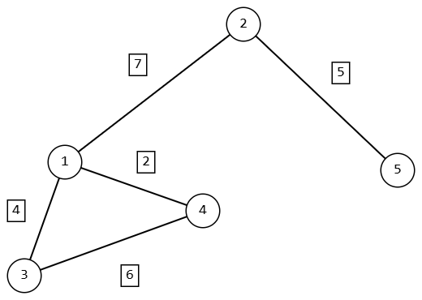

# Алгоритм Дейкстры: реализация на Python



## Содержание

1. [Описание задачи](#описание-задачи)
2. [Суть алгоритма](#суть-алгоритма)
3. [Граф для тестирования](#граф-для-тестирования)
4. [Реализация](#реализация)
5. [Пошаговое выполнение](#пошаговое-выполнение)
6. [Результат](#результат)
7. [Сложность алгоритма](#сложность-алгоритма)
8. [Ключевые термины](#ключевые-термины)
9. [Границы применимости](#границы-применимости)
10. [Определения](#определения)

---

## Описание задачи

Найти **кратчайший путь** от вершины `1` до вершины `5` во взвешенном неориентированном графе с неотрицательными весами
рёбер.

---

## Суть алгоритма

Алгоритм Дейкстры — **жадный** алгоритм поиска кратчайших путей от одной заданной вершины (источника) до всех остальных
во взвешенном графе с **неотрицательными** весами рёбер.

Основной механизм:

1. **Инициализация** — расстояние до источника = `0`, до остальных вершин = `∞`.
2. **Жадный выбор** — извлекаем из приоритетной очереди вершину `u` с наименьшим текущим расстоянием. Это расстояние
   становится **окончательным**.
3. **Релаксация соседей** — для каждого ребра `(u, v)`:
   ```
   если dist[u] + w(u, v) < dist[v]:
       dist[v] = dist[u] + w(u, v)
       prev[v] = u
   ```
4. **Повторение** — шаги 2–3 выполняются, пока очередь не пуста.

> **Почему алгоритм называют жадным?**
> На каждом шаге выбирается локально оптимальное решение — вершина с минимальной текущей оценкой расстояния. Из-за
> неотрицательности весов это решение является и **глобально** оптимальным: никакой обходной путь через ещё
> необработанные вершины не окажется короче.
---

## Граф для тестирования

```
        7
   1 ——————— 2
   |  \      |
 4 |   \ 2   | 5
   |    \    |
   3     4   5
    \   /
   6 \ / 6
      +
```

Список смежности:

| Ребро | Вес |
|-------|-----|
| 1 — 2 | 7   |
| 1 — 3 | 4   |
| 1 — 4 | 2   |
| 3 — 4 | 6   |
| 2 — 5 | 5   |

```python
graph = {
    1: {2: 7, 3: 4, 4: 2},
    2: {1: 7, 5: 5},
    3: {1: 4, 4: 6},
    4: {1: 2, 3: 6},
    5: {2: 5}
}
```

---

## Реализация

```python
import heapq

graph = {
    1: {2: 7, 3: 4, 4: 2},
    2: {1: 7, 5: 5},
    3: {1: 4, 4: 6},
    4: {1: 2, 3: 6},
    5: {2: 5}
}


def dijkstra(start, finish):
    # Инициализация расстояний и предков
    distances = {vertex: float('inf') for vertex in graph}
    parents = {vertex: None for vertex in graph}
    distances[start] = 0

    # Приоритетная очередь: (расстояние, вершина)
    queue = [(0, start)]

    while queue:
        current_distance, current_vertex = heapq.heappop(queue)

        # Пропускаем устаревшие записи
        if current_distance > distances[current_vertex]:
            continue

        # Релаксация соседей
        for neighbor, weight in graph[current_vertex].items():
            new_distance = current_distance + weight
            if new_distance < distances[neighbor]:
                distances[neighbor] = new_distance
                parents[neighbor] = current_vertex
                heapq.heappush(queue, (new_distance, neighbor))

    # Восстановление пути
    path, current = [], finish
    while current is not None:
        path.append(current)
        current = parents[current]
    path.reverse()

    return distances[finish], path


distance, path = dijkstra(1, 5)
print("Кратчайшее расстояние:", distance)
print("Кратчайший путь:", path)
```

### Ключевые детали реализации

| Элемент                                           | Назначение                                                  |
|---------------------------------------------------|-------------------------------------------------------------|
| `heapq`                                           | Минимальная двоичная куча — реализация приоритетной очереди |
| `distances`                                       | Массив текущих кратчайших расстояний от источника           |
| `parents`                                         | Массив предков для восстановления пути                      |
| `if current_distance > distances[current_vertex]` | Фильтрация устаревших записей в куче                        |
| Обратный ход по `parents`                         | Восстановление маршрута от финиша к старту                  |

---

## Пошаговое выполнение

Старт: вершина `1`. Начальное состояние: `dist = {1:0, 2:∞, 3:∞, 4:∞, 5:∞}`.

| Шаг | Извлечена вершина | dist[1] | dist[2] | dist[3] | dist[4] | dist[5] | Обновления                     |
|-----|-------------------|---------|---------|---------|---------|---------|--------------------------------|
| 0   | —                 | **0**   | ∞       | ∞       | ∞       | ∞       | Инициализация                  |
| 1   | **1** (dist=0)    | 0       | 7       | 4       | **2**   | ∞       | Релаксация 2, 3, 4             |
| 2   | **4** (dist=2)    | 0       | 7       | 4       | 2       | ∞       | dist[3] не улучшилось (4 < 8)  |
| 3   | **3** (dist=4)    | 0       | 7       | 4       | 2       | ∞       | dist[4] не улучшилось (10 > 2) |
| 4   | **2** (dist=7)    | 0       | 7       | 4       | 2       | **12**  | Релаксация 5                   |
| 5   | **5** (dist=12)   | 0       | 7       | 4       | 2       | 12      | Финиш достигнут                |

Восстановление пути: `5 ← 2 ← 1` → путь `[1, 2, 5]`.

---

## Результат

```
Кратчайшее расстояние: 12
Кратчайший путь: [1, 2, 5]
```

Маршрут: **1 → 2 → 5**, суммарный вес: `7 + 5 = 12`.

---

## Сложность алгоритма

| Реализация                              | Временная сложность | Когда применять                          |
|-----------------------------------------|---------------------|------------------------------------------|
| Массив + линейный поиск минимума        | `O(V²)`             | Плотные графы (`E ≈ V²`)                 |
| **Двоичная куча** *(данная реализация)* | `O((V + E) log V)`  | Разреженные графы (`E ≪ V²`)             |
| Фибоначчиева куча                       | `O(V log V + E)`    | Теоретический оптимум, редко на практике |

В данном примере: `V = 5`, `E = 5` — граф разреженный, двоичная куча является оптимальным выбором.

---

## Ключевые термины

| Термин                   | Определение                                                                              |
|--------------------------|------------------------------------------------------------------------------------------|
| **Жадный алгоритм**      | Стратегия локально оптимального выбора на каждом шаге, приводящая к глобальному оптимуму |
| **Релаксация ребра**     | Попытка улучшить `dist[v]` через `dist[u] + w(u,v)`                                      |
| **Приоритетная очередь** | Структура данных для быстрого извлечения минимума                                        |
| **Источник (source)**    | Стартовая вершина, от которой считаются расстояния                                       |
| **`dist[v]`**            | Текущая наилучшая известная оценка расстояния до `v`                                     |
| **Обработанная вершина** | Вершина, извлечённая из очереди — её расстояние окончательно                             |
| **Недостижимая вершина** | Вершина, до которой нет пути; `dist` остаётся `∞`                                        |

---

## Границы применимости

| Условие                    |   Алгоритм Дейкстры   | Альтернатива               |
|----------------------------|:---------------------:|----------------------------|
| Неотрицательные веса рёбер |           ✅           | —                          |
| Отрицательные веса рёбер   |           ❌           | Беллман–Форд `O(V·E)`      |
| Невзвешенный граф          | ✅ (вырождается в BFS) | BFS `O(V+E)`               |
| Поиск пути к одной цели    | ✅ (с ранним выходом)  | A* (с эвристикой)          |
| Отрицательные циклы        |           ❌           | Беллман–Форд (детектирует) |

## Определения

### 1. Базовые понятия алгоритма

- **Алгоритм Дейкстры** — жадный алгоритм поиска кратчайших путей от одной заданной вершины (источника) до всех
  остальных в графе с неотрицательными весами рёбер.
- **Жадный алгоритм** — стратегия, при которой на каждом шаге принимается локально оптимальное решение (здесь – выбор
  вершины с минимальным текущим расстоянием), и это решение в итоге приводит к глобально оптимальному результату.
- **Источник (start, source)** — вершина, от которой отсчитываются кратчайшие расстояния (в конспекте – вершина `1`).
- **Куча** — это конкретная реализация приоритетной очереди, которая обеспечивает быстрый доступ к вершине с минимальным
  текущим расстоянием.

### 2. Структуры данных и переменные в реализации

- **Приоритетная очередь** — абстрактная структура данных, поддерживающая быстрое извлечение элемента с наименьшим
  ключом. В коде используется `heapq` — минимальная двоичная куча.
- **Двоичная куча (min-heap)** — конкретная реализация приоритетной очереди на основе бинарного дерева, где родитель не
  больше потомков. Обеспечивает сложность `O((V+E) log V)`.
- **`distances` (массив расстояний)** — словарь, хранящий текущие наилучшие оценки кратчайшего расстояния от источника
  до каждой вершины. Инициализируется `float('inf')`, кроме источника (`0`).
- **`parents` (массив предков)** — словарь, хранящий для каждой вершины её предшественника на текущем кратчайшем пути;
  используется для восстановления маршрута.
- **Обработанная (посещённая) вершина** — вершина, извлечённая из приоритетной очереди с минимальным расстоянием; её
  расстояние считается окончательным и более не изменяется.
- **Устаревшая запись в куче** — ситуация, когда в очереди лежит пара `(d, v)`, а расстояние до `v` уже было улучшено.
  Проверка `if current_distance > distances[current_vertex]` отсеивает такие записи.
- **Восстановление пути** — процедура обратного прохода от конечной вершины к стартовой по массиву `parents` с
  последующим разворотом списка.

### 3. Характеристики алгоритма и графа

- **Временная сложность** — зависит от реализации:
    - Простой массив + линейный поиск минимума: **O(V²)** — для плотных графов.
    - Двоичная куча (как в конспекте): **O((V + E) log V)** — для разреженных графов.
    - Фибоначчиева куча: **O(V log V + E)** — теоретический оптимум, редко применяется на практике.
- **Неотрицательные веса рёбер** — обязательное условие корректной работы алгоритма Дейкстры. При отрицательных весах
  жадный выбор может быть ошибочен.
- **Разреженный граф** — граф, в котором количество рёбер `E` значительно меньше `V²` (в примере граф с 5 вершинами и 5
  рёбрами как раз разреженный).
- **Недостижимая вершина** — вершина, до которой от источника нет пути; её `dist` остаётся равной `∞`.

### 4. Границы применимости и сравнения

- **BFS (поиск в ширину)** — алгоритм для невзвешенных графов (или с единичными весами). Алгоритм Дейкстры вырождается в
  BFS, если все веса одинаковы (или равны 1).
- **Алгоритм Беллмана–Форда** — алгоритм поиска кратчайших путей, способный работать с отрицательными весами (но
  медленнее: `O(V·E)`), а также обнаруживать отрицательные циклы.
- **Алгоритм A*** — эвристическое расширение Дейкстры для ускоренного поиска пути к одной заданной вершине, использующее
  оценочную функцию (эвристику).

### 5. Что ещё могут спросить (особенности конспекта)

- **Почему в коде используется `heapq.heappop` и `heapq.heappush`?**  
  `heappop` извлекает кортеж с минимальным расстоянием, а `heappush` добавляет новую пару (расстояние, вершина) с
  сохранением свойств кучи.
- **Что означает строчка `if current_distance > distances[current_vertex]: continue`?**  
  Это защита от обработки устаревшей записи: если из кучи извлеклось расстояние, которое больше уже известного
  оптимального для этой вершины, значит эту запись можно игнорировать.
- **Как изменится алгоритм, если выйти сразу после извлечения конечной вершины?**  
  В конспекте выполняется полный обход, но если после извлечения `current_vertex == finish` прервать цикл, мы всё равно
  получим корректное расстояние (оно уже окончательное), однако путь уже можно восстанавливать. Это оптимизация для
  поиска до одной цели.

### 6. Связь с вашим конкретным графом (защита примера)

- Уметь показывать по шагам таблицу релаксаций и объяснять, почему на каждом шаге выбиралась та или иная вершина, а
  также почему некоторые обновления не происходили (например, на шаге 2: `dist[3]` не улучшилось, потому что
  `2+6 = 8 > 4`).
- Понимать, что кратчайший путь `[1, 2, 5]` весом 12 — это действительно минимальный, и альтернативные пути (через 3 и
  4) не дают лучшего результата.
